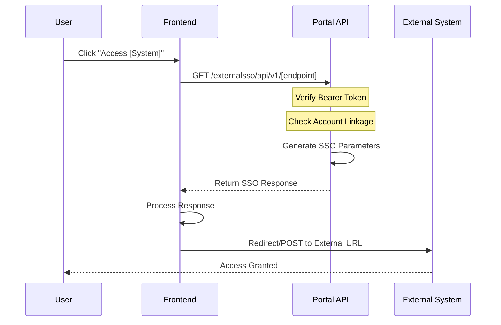

# External SSO Implementation Plan

**Document Version:** 1.0
**Created:** 2025-12-27
**API Version:** 0.0.1
**Source:** iTrade-ExternalSSOAPI.yaml

---

## Table of Contents

1. [Overview](#overview)
2. [External Systems](#external-systems)
3. [API Endpoints Summary](#api-endpoints-summary)
4. [Authentication Flow](#authentication-flow)
5. [Integration Patterns](#integration-patterns)
6. [Implementation Status](#implementation-status)
7. [Frontend Integration Plan](#frontend-integration-plan)
8. [Security Considerations](#security-considerations)
9. [Error Handling](#error-handling)
10. [Testing Strategy](#testing-strategy)
11. [Deployment Checklist](#deployment-checklist)

---

## Overview

### Purpose
The External SSO API provides seamless single sign-on integration with 8 external CGSI systems, allowing authenticated users to access external platforms without re-entering credentials.

### Base URL
```
Production: https://stgitrade.cgsi.com.sg/portal/externalsso/api/v1
Development: http://localhost:8080/portal/externalsso/api/v1
```

### Authentication
All endpoints require **Bearer Token** authentication via Authorization header.

---

## External Systems

### 1. **NTP (Next Trading Platform)** ✅
- **Purpose:** Primary trading platform for executing trades
- **URL:** `https://sg.itradecgsi.com/gcCGSIPlus/ext/cliChkLoginSSO.jsp`
- **Integration Type:** Form POST with TOGA token & SAML assertion
- **Status:** Implemented

### 2. **Research Portal** ✅
- **Purpose:** Access to market research and analysis
- **URL:** `https://research.cgsi.com/ResearchSSOLogin.aspx`
- **Integration Type:** Direct redirect with signed parameters
- **Status:** Implemented

### 3. **eStatement (iTrade TruContent)** ✅
- **Purpose:** Access electronic statements and documents
- **URL:** `https://www.itradecimb.com.sg/app/mobile.estatement.z`
- **Integration Type:** Direct redirect with signed code
- **Status:** Implemented

### 4. **Corporate Action** ✅
- **Purpose:** Manage corporate actions (dividends, rights, etc.)
- **URL:** `https://xsprisa-asa01-xsp.fiscloudservices.com/CGS_eTRANPlus/SAML/AssertionConsumerService.aspx`
- **Integration Type:** SAML Form POST
- **Status:** Implemented

### 5. **Stock Filter** ✅
- **Purpose:** Stock screening and filtering tool
- **URL:** `https://www2.trkd-hs.com/cgsi/screener`
- **Integration Type:** Direct redirect with encrypted ID
- **Status:** Implemented

### 6. **EW8** ✅
- **Purpose:** W8 tax form management
- **URL:** `https://ew8.cgsi.com/EW8/Authentication/CIMBSSOLogin`
- **Integration Type:** Direct redirect with signed code
- **Status:** Implemented

### 7. **ECRS** ✅
- **Purpose:** Electronic customer relationship system
- **URL:** `https://ew8.cgsi.com/ECRS/Authentication/CIMBSSOLogin`
- **Integration Type:** Direct redirect with signed code
- **Status:** Implemented

### 8. **iScreener** ⚠️ NOT IMPLEMENTED
- **Purpose:** Advanced stock screening tool
- **URL:** `https://ken.nifi-is1.com/cgsi/GlobalIndices.html`
- **Integration Type:** Direct redirect with encrypted token
- **Status:** ⚠️ **Never implemented in iTrade Portal** (as noted in YAML spec)

---

## API Endpoints Summary

| Endpoint | Method | Response Type | Implementation |
|----------|--------|---------------|----------------|
| `/ntp` | GET | Complex (Form POST) | ✅ Implemented |
| `/research` | GET | Redirect URL | ✅ Implemented |
| `/estatement` | GET | Redirect URL | ✅ Implemented |
| `/corporateAction` | GET | SAML Form POST | ✅ Implemented |
| `/stockFilter` | GET | Redirect URL | ✅ Implemented |
| `/ew8` | GET | Redirect URL | ✅ Implemented |
| `/ecrs` | GET | Redirect URL | ✅ Implemented |
| `/iscreener` | GET | Redirect URL | ⚠️ Not Implemented |

---

## Authentication Flow

### General Flow



### Token Requirements
- **Authorization Header:** `Bearer <access_token>`
- **Token Type:** JWT
- **Token Source:** `/sso/api/v1/token` endpoint
- **Validation:** Backend validates token and user account linkage

---

## Integration Patterns

### Pattern 1: Direct Redirect (Simple)
**Used by:** Research, eStatement, Stock Filter, EW8, ECRS

```typescript
// API Response
{
  "redirectUrl": "https://external-system.com/sso?code=xyz&timestamp=123&sign=abc"
}

// Frontend Implementation
const response = await fetchAPI(ENDPOINTS.ssoResearch(), { useAuth: true });
if (response.success && response.data?.redirectUrl) {
  window.location.href = response.data.redirectUrl;
}
```

**Steps:**
1. Call API endpoint
2. Receive `redirectUrl` in response
3. Redirect user to URL (opens external system)

---

### Pattern 2: Form POST with Multiple Parameters (Complex)
**Used by:** NTP

```typescript
// API Response
{
  "postUrl": "https://sg.itradecgsi.com/gcCGSIPlus/ext/cliChkLoginSSO.jsp",
  "act": "1",
  "togaToken": "ZkrwI46hUE3xDuKkxhvUdLzCLYoqzc1QgLlrI9zGsvU=",
  "assertion": "Fc0vD83iuMkAvuMKnLQvxNlULnyzsMxJQa9abZ0P89k...",
  "transactionId": "74286ac2a84a4c50",
  "page": "P"
}

// Frontend Implementation
const response = await fetchAPI(ENDPOINTS.ssoNTP(), { useAuth: true });
if (response.success && response.data) {
  const { postUrl, act, togaToken, assertion, transactionId, page } = response.data;

  // Create hidden form and submit
  const form = document.createElement('form');
  form.method = 'POST';
  form.action = postUrl;

  // Add hidden fields
  const fields = { act, togaToken, assertion, transactionId, page };
  Object.entries(fields).forEach(([key, value]) => {
    const input = document.createElement('input');
    input.type = 'hidden';
    input.name = key;
    input.value = value;
    form.appendChild(input);
  });

  document.body.appendChild(form);
  form.submit();
}
```

**Steps:**
1. Call API endpoint
2. Receive multiple parameters (postUrl, tokens, assertions)
3. Create hidden HTML form with parameters
4. Submit form (POST) to external system

---

### Pattern 3: SAML Form POST
**Used by:** Corporate Action

```typescript
// API Response
{
  "postUrl": "https://xsprisa-asa01-xsp.fiscloudservices.com/CGS_eTRANPlus/SAML/AssertionConsumerService.aspx",
  "samlResponse": "CjxzYW1scDI6UmVzcG9uc2UgSUQ9Il81ZGUwZmIxNC04MzJlLTQwNzktYjUwNi02Mjc2YzhjYWQ4ZmQi..."
}

// Frontend Implementation
const response = await fetchAPI(ENDPOINTS.ssoCorporateAction(), { useAuth: true });
if (response.success && response.data) {
  const { postUrl, samlResponse } = response.data;

  // Create SAML form
  const form = document.createElement('form');
  form.method = 'POST';
  form.action = postUrl;

  const samlInput = document.createElement('input');
  samlInput.type = 'hidden';
  samlInput.name = 'SAMLResponse';
  samlInput.value = samlResponse;

  form.appendChild(samlInput);
  document.body.appendChild(form);
  form.submit();
}
```

**Steps:**
1. Call API endpoint
2. Receive SAML response (base64 encoded XML)
3. Create form with `SAMLResponse` field
4. Submit to SAML assertion consumer service

---

## Implementation Status

### Backend (API Layer) ✅

**Files:**
- `lib/api/endpoints/externalSSO.ts` - Endpoint definitions
- `lib/services/ssoService.ts` - Service layer (NEW - untracked)
- `lib/api/types.ts` - TypeScript type definitions

**Endpoints Defined:**
```typescript
export const externalSSOEndpoints = {
  ssoNTP: () => `/externalsso/api/v1/ntp`,
  ssoResearch: () => `/externalsso/api/v1/research`,
  ssoEStatement: () => `/externalsso/api/v1/estatement`,
  ssoCorporateAction: () => `/externalsso/api/v1/corporateAction`,
  ssoStockFilter: () => `/externalsso/api/v1/stockFilter`,
  ssoEW8: () => `/externalsso/api/v1/ew8`,
  ssoECRS: () => `/externalsso/api/v1/ecrs`,
  ssoIScreener: () => `/externalsso/api/v1/iscreener`, // ⚠️ Not implemented
}
```

**Status:** ✅ All endpoint definitions complete

---

### Frontend (UI Layer) ❓ To Be Verified

**Expected Locations:**
- Menu/Navigation with links to external systems
- Buttons/Cards in dashboard or portfolio pages
- Utility functions for form submission

**Required Components:**
1. **SSO Redirect Handler** - Utility to process API responses and redirect
2. **Form POST Handler** - For NTP and Corporate Action patterns
3. **UI Components** - Buttons/links to trigger SSO
4. **Error Handling** - Display user-friendly messages on SSO failures

**Status:** ❓ Requires frontend code review

---

## Frontend Integration Plan

### Step 1: Create SSO Utility Service

**File:** `lib/services/ssoRedirect.ts`

```typescript
import { ENDPOINTS } from "@/lib/api/endpoints";
import { fetchAPI } from "@/lib/fetchWrapper";

/**
 * SSO Response Types
 */
export type SSORedirectResponse = {
  redirectUrl: string;
};

export type SSOFormPostResponse = {
  postUrl: string;
  [key: string]: string;
};

export type SSOSAMLResponse = {
  postUrl: string;
  samlResponse: string;
};

/**
 * Handle simple redirect SSO (Research, eStatement, etc.)
 */
export async function handleSSORedirect(
  endpoint: string,
  systemName: string
): Promise<void> {
  try {
    const response = await fetchAPI<SSORedirectResponse>(endpoint, {
      useAuth: true,
    });

    if (response.success && response.data?.redirectUrl) {
      window.location.href = response.data.redirectUrl;
    } else {
      throw new Error(response.error || `Failed to access ${systemName}`);
    }
  } catch (error) {
    console.error(`SSO Error (${systemName}):`, error);
    throw error;
  }
}

/**
 * Handle form POST SSO (NTP)
 */
export async function handleSSOFormPost(
  endpoint: string,
  systemName: string
): Promise<void> {
  try {
    const response = await fetchAPI<SSOFormPostResponse>(endpoint, {
      useAuth: true,
    });

    if (response.success && response.data?.postUrl) {
      const { postUrl, ...formData } = response.data;

      // Create and submit hidden form
      const form = document.createElement("form");
      form.method = "POST";
      form.action = postUrl;
      form.style.display = "none";

      Object.entries(formData).forEach(([key, value]) => {
        const input = document.createElement("input");
        input.type = "hidden";
        input.name = key;
        input.value = value;
        form.appendChild(input);
      });

      document.body.appendChild(form);
      form.submit();
    } else {
      throw new Error(response.error || `Failed to access ${systemName}`);
    }
  } catch (error) {
    console.error(`SSO Error (${systemName}):`, error);
    throw error;
  }
}

/**
 * Handle SAML POST SSO (Corporate Action)
 */
export async function handleSSOSAML(
  endpoint: string,
  systemName: string
): Promise<void> {
  try {
    const response = await fetchAPI<SSOSAMLResponse>(endpoint, {
      useAuth: true,
    });

    if (response.success && response.data?.postUrl && response.data?.samlResponse) {
      const { postUrl, samlResponse } = response.data;

      // Create SAML form
      const form = document.createElement("form");
      form.method = "POST";
      form.action = postUrl;
      form.style.display = "none";

      const samlInput = document.createElement("input");
      samlInput.type = "hidden";
      samlInput.name = "SAMLResponse";
      samlInput.value = samlResponse;

      form.appendChild(samlInput);
      document.body.appendChild(form);
      form.submit();
    } else {
      throw new Error(response.error || `Failed to access ${systemName}`);
    }
  } catch (error) {
    console.error(`SSO Error (${systemName}):`, error);
    throw error;
  }
}

/**
 * Convenience functions for each system
 */
export const SSO = {
  // Simple redirects
  research: () => handleSSORedirect(ENDPOINTS.ssoResearch(), "Research Portal"),
  eStatement: () => handleSSORedirect(ENDPOINTS.ssoEStatement(), "eStatement"),
  stockFilter: () => handleSSORedirect(ENDPOINTS.ssoStockFilter(), "Stock Filter"),
  ew8: () => handleSSORedirect(ENDPOINTS.ssoEW8(), "EW8"),
  ecrs: () => handleSSORedirect(ENDPOINTS.ssoECRS(), "ECRS"),

  // Form POST
  ntp: () => handleSSOFormPost(ENDPOINTS.ssoNTP(), "NTP Trading Platform"),

  // SAML POST
  corporateAction: () => handleSSOSAML(ENDPOINTS.ssoCorporateAction(), "Corporate Action"),
};
```

---

### Step 2: Create UI Components

**Example Button Component:**

```typescript
// components/ExternalSystemButton.tsx
"use client";

import { useState } from "react";
import { Button } from "@/components/ui/button";
import { SSO } from "@/lib/services/ssoRedirect";
import { toast } from "sonner";

type ExternalSystem =
  | "ntp"
  | "research"
  | "eStatement"
  | "corporateAction"
  | "stockFilter"
  | "ew8"
  | "ecrs";

interface ExternalSystemButtonProps {
  system: ExternalSystem;
  children: React.ReactNode;
  variant?: "default" | "outline" | "ghost";
}

export function ExternalSystemButton({
  system,
  children,
  variant = "default",
}: ExternalSystemButtonProps) {
  const [loading, setLoading] = useState(false);

  const handleClick = async () => {
    setLoading(true);
    try {
      await SSO[system]();
    } catch (error) {
      toast.error(
        error instanceof Error ? error.message : "Failed to access system"
      );
    } finally {
      setLoading(false);
    }
  };

  return (
    <Button onClick={handleClick} disabled={loading} variant={variant}>
      {loading ? "Connecting..." : children}
    </Button>
  );
}
```

**Usage:**

```tsx
import { ExternalSystemButton } from "@/components/ExternalSystemButton";

export function PortfolioPage() {
  return (
    <div>
      <h1>Portfolio</h1>

      {/* Access Trading Platform */}
      <ExternalSystemButton system="ntp">
        Trade Now
      </ExternalSystemButton>

      {/* Access Research */}
      <ExternalSystemButton system="research" variant="outline">
        View Research
      </ExternalSystemButton>

      {/* Access eStatement */}
      <ExternalSystemButton system="eStatement" variant="ghost">
        Statements
      </ExternalSystemButton>
    </div>
  );
}
```

---

### Step 3: Add to Navigation/Menu

**Expected Locations:**
- Header navigation (link to NTP, Research)
- Portfolio page (quick access to trading, statements)
- Settings/Profile (access to corporate action, EW8, ECRS)
- Market Data page (stock filter, research)

---

## Security Considerations

### 1. Token Security ✅
- **Implementation:** All endpoints require Bearer token
- **Validation:** Backend validates token before generating SSO parameters
- **Expiry:** Tokens expire, frontend should handle refresh flow

### 2. Account Linkage Validation ✅
- **Error Code:** 404 - No Accounts Linked
- **Frontend Handling:** Display user-friendly message
- **Action:** Prompt user to link account or contact support

### 3. Parameter Signing ✅
- **NTP:** Uses TOGA token + assertion (encrypted/signed by backend)
- **Research/eStatement/EW8/ECRS:** URLs include signature parameter
- **Corporate Action:** SAML response is signed with X.509 certificate
- **Stock Filter:** ID parameter is encrypted

### 4. HTTPS Enforcement ✅
- **Requirement:** All external systems use HTTPS
- **Production URLs:** Verified to use `https://`

### 5. CSRF Protection
- **Form POST:** Consider adding CSRF tokens if needed
- **Same-Site Cookies:** Ensure proper cookie settings

### 6. XSS Prevention
- **Form Creation:** Use DOM APIs (not innerHTML)
- **Parameter Encoding:** Backend must properly encode all parameters

---

## Error Handling

### API Error Responses

| Status Code | Meaning | User Message | Action |
|-------------|---------|--------------|--------|
| 400 | Invalid Request | "Invalid request. Please try again." | Log error, show generic message |
| 404 | No Accounts Linked | "No account linked. Please link your account first." | Redirect to account linking page |
| 422 | Validation Exception | "Unable to access system. Please contact support." | Show support contact info |
| 500 | Server Error | "System temporarily unavailable. Please try again later." | Retry option |

### Frontend Error Handling Pattern

```typescript
try {
  await SSO.ntp();
} catch (error) {
  if (error.statusCode === 404) {
    toast.error("No account linked. Please link your account first.", {
      action: {
        label: "Link Account",
        onClick: () => router.push(INTERNAL_ROUTES.ACCOUNT_LINKAGE),
      },
    });
  } else {
    toast.error("Failed to access trading platform. Please try again.");
  }
}
```

---

## Testing Strategy

### Unit Tests

**Backend Service Tests:**
```typescript
// lib/services/__tests__/ssoService.test.ts
describe("SSO Service", () => {
  it("should generate NTP SSO parameters", async () => {
    const result = await getSSOParametersForNTP(mockUserId);
    expect(result).toHaveProperty("postUrl");
    expect(result).toHaveProperty("togaToken");
    expect(result).toHaveProperty("assertion");
  });

  it("should throw error for unlinked account", async () => {
    await expect(getSSOParametersForNTP(unlinkedUserId)).rejects.toThrow(
      "No Accounts Linked"
    );
  });
});
```

**Frontend Utility Tests:**
```typescript
// lib/services/__tests__/ssoRedirect.test.ts
describe("SSO Redirect", () => {
  it("should redirect to research portal", async () => {
    mockFetchAPI.mockResolvedValue({
      success: true,
      data: { redirectUrl: "https://research.cgsi.com/..." },
    });

    delete window.location;
    window.location = { href: "" } as any;

    await SSO.research();

    expect(window.location.href).toContain("research.cgsi.com");
  });
});
```

---

### Integration Tests

**API Endpoint Tests:**
```bash
# Test NTP SSO
GET /externalsso/api/v1/ntp
Headers: Authorization: Bearer <token>
Expected: 200 + { postUrl, togaToken, assertion, transactionId, page }

# Test Research SSO
GET /externalsso/api/v1/research
Headers: Authorization: Bearer <token>
Expected: 200 + { redirectUrl }

# Test without token
GET /externalsso/api/v1/ntp
Expected: 401 Unauthorized

# Test unlinked account
GET /externalsso/api/v1/ntp
Headers: Authorization: Bearer <unlinked_user_token>
Expected: 404 No Accounts Linked
```

---

### Manual Testing Checklist

#### Pre-requisites
- [ ] Valid Bearer token obtained
- [ ] User account linked to trading account
- [ ] Access to staging environment

#### Test Cases

**1. NTP Trading Platform**
- [ ] Click "Trade Now" button
- [ ] Verify form POST with all parameters
- [ ] Confirm successful login to NTP
- [ ] Test with unlinked account (expect 404 error)

**2. Research Portal**
- [ ] Click "Research" link
- [ ] Verify redirect to research.cgsi.com
- [ ] Confirm automatic login

**3. eStatement**
- [ ] Access eStatement link
- [ ] Verify redirect to itradecimb.com.sg
- [ ] Confirm statement access

**4. Corporate Action**
- [ ] Access Corporate Action
- [ ] Verify SAML form POST
- [ ] Confirm access to corporate action system

**5. Stock Filter**
- [ ] Click Stock Filter
- [ ] Verify redirect with encrypted ID
- [ ] Confirm screener loads

**6. EW8 / ECRS**
- [ ] Access EW8 link
- [ ] Verify redirect and login
- [ ] Access ECRS link
- [ ] Verify redirect and login

**7. Error Cases**
- [ ] Test without authentication (expect 401)
- [ ] Test with expired token (expect 401)
- [ ] Test with unlinked account (expect 404)
- [ ] Test network failure handling

---

## Deployment Checklist

### Backend Deployment

- [ ] **API Endpoints Deployed**
  - [ ] `/externalsso/api/v1/ntp`
  - [ ] `/externalsso/api/v1/research`
  - [ ] `/externalsso/api/v1/estatement`
  - [ ] `/externalsso/api/v1/corporateAction`
  - [ ] `/externalsso/api/v1/stockFilter`
  - [ ] `/externalsso/api/v1/ew8`
  - [ ] `/externalsso/api/v1/ecrs`

- [ ] **Security Configuration**
  - [ ] Bearer token validation configured
  - [ ] CORS headers set correctly
  - [ ] Rate limiting enabled
  - [ ] Logging configured for SSO events

- [ ] **External System Configuration**
  - [ ] NTP TOGA credentials configured
  - [ ] SAML certificate for Corporate Action installed
  - [ ] Research portal API keys configured
  - [ ] All external URLs verified in production

### Frontend Deployment

- [ ] **Service Layer**
  - [ ] `ssoRedirect.ts` utility created and tested
  - [ ] Error handling implemented
  - [ ] Toast notifications configured

- [ ] **UI Components**
  - [ ] ExternalSystemButton component created
  - [ ] Buttons added to relevant pages (portfolio, header, etc.)
  - [ ] Loading states implemented
  - [ ] Disabled states for errors

- [ ] **Navigation**
  - [ ] Links added to header/menu
  - [ ] Mobile navigation updated
  - [ ] Quick access shortcuts added

### Testing & Validation

- [ ] **Staging Environment**
  - [ ] All SSO endpoints tested
  - [ ] Error cases verified
  - [ ] Cross-browser testing complete
  - [ ] Mobile testing complete

- [ ] **Production Readiness**
  - [ ] Performance testing complete
  - [ ] Security audit passed
  - [ ] Monitoring/alerting configured
  - [ ] Documentation updated

### Monitoring

- [ ] **Logging**
  - [ ] SSO request logging enabled
  - [ ] Error tracking configured (Sentry, etc.)
  - [ ] Success/failure metrics tracked

- [ ] **Alerts**
  - [ ] High error rate alerts
  - [ ] External system downtime alerts
  - [ ] Token validation failure alerts

---

## Open Questions / Decisions Needed

1. **iScreener Implementation**
   - ❓ Should we implement iScreener SSO despite the note saying it was "never implemented"?
   - **Recommendation:** Skip unless there's a business requirement

2. **Account Linking Flow**
   - ❓ What should happen when user has no linked account (404 error)?
   - **Recommendation:** Show modal with "Link Account" button → redirect to account linking page

3. **Session Management**
   - ❓ How long should SSO sessions last on external systems?
   - **Recommendation:** Defer to external system's session timeout

4. **Error Tracking**
   - ❓ Should SSO errors be logged to analytics?
   - **Recommendation:** Yes, track SSO failures by system and error type

5. **Mobile App Support**
   - ❓ How should SSO work in mobile app (deep links, in-app browser)?
   - **Recommendation:** Use in-app browser for seamless experience

---

## Next Steps

### Immediate Actions
1. ✅ Review this plan with team
2. ⏳ Verify backend implementation status
3. ⏳ Conduct frontend code review to assess current SSO integration
4. ⏳ Create frontend utility service (`ssoRedirect.ts`)
5. ⏳ Implement UI components

### Short-term Goals
1. Complete NTP integration (highest priority - trading platform)
2. Add Research and eStatement links
3. Implement error handling and user messaging
4. Test all SSO flows in staging

### Long-term Considerations
1. Monitor SSO success/failure rates
2. Gather user feedback on SSO experience
3. Consider implementing SSO session persistence
4. Evaluate need for iScreener implementation

---

## References

- **API Spec:** `docs/swagger/iTrade-ExternalSSOAPI.yaml`
- **Endpoint Definitions:** `lib/api/endpoints/externalSSO.ts`
- **Service Layer:** `lib/services/ssoService.ts`
- **Postman Collection:** `CGSI_iTrade_Portal_APIs.postman_collection.json`

---

**Document Maintained By:** Development Team
**Last Updated:** 2025-12-27
**Review Frequency:** Quarterly or when API changes
